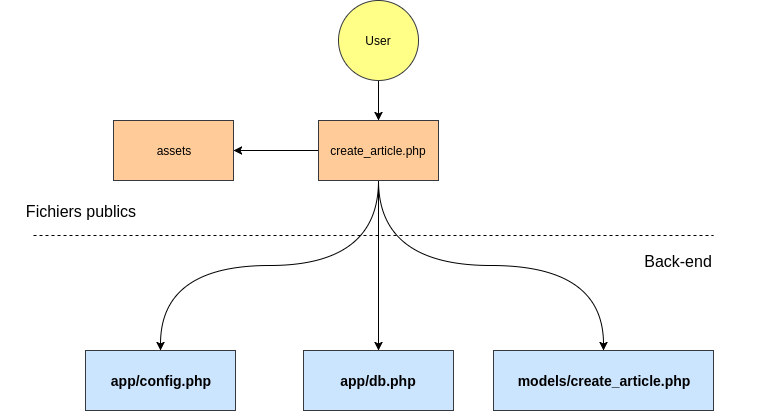

# WorkshopPHP

Repo git du workshop php de la web1 p2020 du 02/02/18.

* PHP, MySQL, Composer.. c koi ?
* les bdd (+adminer/phpmyadmin)
* TP mini projet

# LISEZ L'HISTOIRE

## Organisation des fichiers et fonctionnement

Le fonctionnement du mini projet est très simple, un fichier `system.php` dans `./app/config` sert à initialiser les constantes et la connexion à la base de donnée (BDD ou DB en anglais), `db.php` contient les informations de connexion à la base de donnée.

Dans `./public` se trouve les fichiers publiques : les assets (css, js, images ...) ainsi que les pages disponibles, répondants aux fonctions de base d'un CRUD (Create Read Update Delete).

Les pages dans `./public` contiennent du HTML et appellent un fichier php (modèle) dans `./models` permettant le traitement des données. On sépare volontairement le traitement des données du HTML (la vue) pour une meilleure organisation et une meilleure lisibilité. Cela vous permettra de vous familiariser avec le principe du MVC (Modèle Vue Controlleur), dont le principe est de séparer chaque action du programme (notamment avec l'utilisation de l'orienté objet) pour une meilleure stabilité et flexibilité. Ici, il n'y a pas de vue ou de controller, c'est juste un début de mvc.

~~~
    |-- app/config/
        |-- system.php
        |-- db.php
        |-- db.php.dist
    |-- models/
        |-- create_article.php
        |-- get_article.php
        |-- update_article.php
        |-- delete_article.php
    |-- public/
        |-- assets/
        |-- do/
            |-- create_article.php
            |-- update_article.php
            |-- delete_article.php
        |-- index.php
        |-- create_article.php
        |-- update_article.php
        |-- delete_article.php
~~~

Dans `./do` on mettra les fichiers permettant d'executer les actions <a href="https://github.com/Bunkermaster/crud-webp2020-g1">CRUD</a>. Par exemple : `./public/do/create_article.php` recevra les données du formulaire de `./public/create_article.php` afin de l'insérer dans la BDD.

## Intéraction avec la base de donnée
Pour la base de donnée, on utilisera MySQL avec <a href="http://php.net/manual/en/class.pdo.php">PDO</a>.

La connexion à la BDD se fait dans `system.php`.

~~~ php
// connexion à la bdd
$dsn = "mysql:host=".$db['host'].";dbname=".$db['dbname'];

$options = array(
    PDO::ATTR_PERSISTENT    => true,
    PDO::ATTR_ERRMODE       => PDO::ERRMODE_EXCEPTION
);

try {
    $bdd = new PDO($dsn, $db['user'], $db['password'], $options);
}
// catch any errors
catch (PDOException $e) {
    $error = $e->getMessage();
}

// $bdd sera donc la variable à utiliser pour manipuler la BDD
~~~

Pour effectuer une requête

~~~ php
$stmt = $bdd->query('SELECT * FROM articles');
// ou
$stmt = $bdd->prepare('SELECT * FROM articles');

// On execute la requête préparée ci-dessus
$stmt->execute(); // uniquement après un prepare

$articles = $stmt->fetchAll(); // fetch() pour une seule entrée, fetchAll() pour plusieurs entrées
~~~

Les différents types de requêtes SQL

* <a href="http://sql.sh/cours/insert-into">INSERT</a>
* <a href="http://sql.sh/cours/select">SELECT</a>
* <a href="http://sql.sh/cours/update">UPDATE</a>
* <a href="http://sql.sh/cours/delete">DELETE</a>

## Sécurité

Il y a trois failles de sécurité possibles sur ce programme : la faille XSS, l'injection SQL et CSRF.

#### La faille XSS
La faille XSS peut être évitée simplement en utilisant `htmlentities()` sur chaque variable qu'on affiche dans le html. La faille XSS consiste à injecter du code dans un champs afin qu'il soit traité comme du HTML dans la page. Par exemple écrire `<h1>PARCE QUE C'EST NOTRE PROJET §!!!</h1>` dans un champs de texte afin que la balise `<h1>` soit prise en compte par le navigateur comme étant une vraie balise HTML, on pourrait très bien le faire avec une balise `<script>` et donc y injecter du code malveillant. `htmlentities()` sert donc à transformer les `<` et autres caractères pouvant poser problème dans le formattage <a href="http://php.net/manual/fr/function.htmlentities.php">en entités HTML</a>.

#### L'injection SQL
L'injection SQL est impossible car les requête sont préparées et ce principe ne permet pas l'injection de variables directement dans la requête. Le principe des requêtes préparées est de séparer la requêtes des variables pour empêcher de détourner la requête de son but initial en y insérant un code malveillant.

#### La faille CSRF
<a href="https://openclassrooms.com/courses/protegez-vous-efficacement-contre-les-failles-web/la-csrf">La faille CSRF</a> (à ne pas confondre avec <a href="https://openclassrooms.com/courses/protegez-vous-efficacement-contre-les-failles-web/faille-crlf">CRLF</a>) est une faille qui consiste à utiliser l'URL d'un script pour effectuer une action par le biai d'un utilisateur qui en a l'accès. Notre page delete_article.php est accessible par tous, mais il s'agit d'une page qu'on appelle avec la méthode GET, autrement dit, quelqu'un pourrait vous envoyer le lien pour que vous supprimiez votre article involontairement. On contourne le problème avec l'utilisation d'un **token CSRF**. C'est un token propre à la session que vous êtes le seul à détenir, elle change à chaque connexion. On indique le token en paramètre dans l'url et on vérifie simplement si il correspond avec celui de la session. Dans ce contexte précis c'est un peu inutile parce que n'importe qui peut supprimer n'importe quel article car il n'y a pas de système de login.

## Le serveur php

~~~ bash
php -S localhost:8000 -t ./public
~~~

Le paramètre `-t ./public` permet d'indiquer à php d'utiliser le dossier public comme racine du serveur. Tout ce qui est en dehors du dossier public sera donc inaccessible par l'utilisateur.

## Utile pour votre SI
* <a href="https://codepen.io/terf/post/php-pdo-functions">PHP/PDO Functions</a>
* <a href="http://php.net/manual/fr/language.exceptions.php">Les exceptions</a> (le `try { ... }`)

Pensez aussi à toujours débugger vos variables avec `var_dump()`, l'équivalent du `console.log()` en js.
